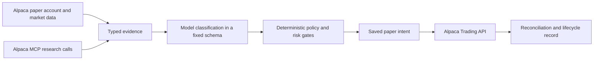

# alphadecay

**Know when the option stopped matching the thesis.**

Opening an options trade is easy. The harder question comes later: does the position still match the reason it was opened?

alphadecay keeps a paper option trade beside its original thesis and intended exposure. It measures the position's current Greeks, checks for drift, and compares four outcomes: `HOLD`, `CLOSE`, `ROLL`, or `NO_ACTION`. The decision comes from fixed policy code. A model may classify supplied evidence, but it cannot choose an action or place an order.

Start with the [quick tour and API guide](docs/public/AGENT_GUIDE.md). It covers the browser Replay and public API calls without credentials or setup.



That is the production path. Public Replay begins with a typed fixture stored in the repository and stops before order entry.

## What works in this repository

The tested Replay runs four fixed options scenarios through the same decision policy. Each one is labeled `REPLAY · SAMPLE DATA · NO ORDER SENT`. It shows the saved thesis, later sample state, current exposure, rejected alternatives, expected exposure after the action, and a separate record showing that execution was disabled.

The Friday entry gate returned `NO_TRADE`, so the competition account sent no order. That is the result of the gate, not a performance claim.

We also ran a limited rehearsal against the development paper account. alphadecay reached Alpaca's paper endpoint through the Trading API, read the market clock through MCP, checked the pinned CLI dry run, and left the account unchanged without sending an order. The sanitized [provider receipt](docs/public/PROVIDER_REHEARSAL_PROOF.json) shows development integration, not competition performance or a paper fill. An autonomous broker write has not been proven.

Deployment availability is kept separate from repository tests. The [public Replay](https://alphadecay.onrender.com) and public repository can be checked without signing in. The health response identifies the exact Render commit so the running app can be compared with the repository.

## Run the Replay locally

You need Git, Python 3.12, [uv](https://docs.astral.sh/uv/) 0.12.3, Node.js 24.16.0, and npm 11.13.0.

```bash
git clone https://github.com/broken-branch/alphadecay.git
cd alphadecay
uv sync --python 3.12 --frozen --all-groups
npm ci
npm run build
uv run --python 3.12 uvicorn backend.app.main:app --host 127.0.0.1 --port 8000
```

Open `http://127.0.0.1:8000`, then choose a Replay scenario. This local Replay needs no Alpaca or model credentials and cannot send an order.

Do not copy real credentials into the repository. [`.env.example`](.env.example) documents the production variable names with placeholders only.

## Check the build

```bash
uv run --python 3.12 pytest -q
uv run --python 3.12 ruff check \
  backend ops/contracts \
  ops/release/generate_third_party_notices.py \
  ops/release/test_third_party_notices.py
uv run --python 3.12 python -m ops.contracts.generate_openapi
git diff --exit-code -- contracts/openapi-v1.json
npm test -- --run
npm run typecheck
npm run build
uv run --python 3.12 python -m ops.release.generate_third_party_notices --check
python3 ops/quality/public_copy_check.py
python3 ops/quality/render_blueprint_check.py
python3 ops/quality/public_link_check.py --root . README.md docs/public/*.md
```

See [Reproducing the evidence](docs/public/REPRODUCIBILITY.md) for the limits of each check.

## How Alpaca fits

- **Trading API:** typed adapters for the paper account, market data, option orders, and reconciliation. Only the authenticated scheduler can dispatch a stored paper intent, and only after both the server and account autonomy gates are armed. This revision does not claim proof of an autonomous broker write.
- **MCP server:** a research client that cannot write to Alpaca. The app chooses from a small allowlist and passes only bounded structured fields onward.
- **CLI:** a bootstrap and inspection tool used by the operator. It stays outside the web application and production image. The public proof records a pinned options dry run against Alpaca's paper host. It did not submit an order.

The [provider rehearsal receipt](docs/public/PROVIDER_REHEARSAL_PROOF.json) ties those three Alpaca surfaces to one production run. It contains no account, order, position, activity, or credential identifiers.

The sponsor requirement is the Trading API plus either MCP or CLI. alphadecay's design gives each surface a separate job instead of treating dependency installation as proof of use.

## Documentation

- [Architecture](docs/public/ARCHITECTURE.md)
- [Setup](docs/public/SETUP.md)
- [Reproducing the evidence](docs/public/REPRODUCIBILITY.md)
- [Limitations](docs/public/LIMITATIONS.md)

## Safety

alphadecay is restricted to Alpaca paper trading. Its configuration rejects the live Alpaca endpoint. Replay is fixture data, paper fills are simulations, and nothing here is investment advice.

## License

[MIT](LICENSE). Package licenses and retained terms are listed in
[Third-party notices](THIRD_PARTY_NOTICES.md).
