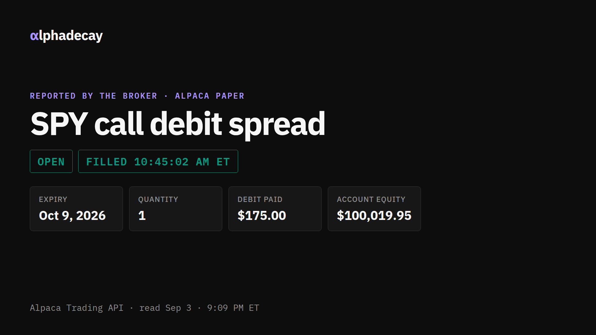

# alphadecay

AlphaDecay is an options trading agent that writes down why it wants a trade before it places the trade, then checks its own work against that written reason every time it looks at the market.



## What happened in the competition

On September 3, 2026 at 10:45:02 AM ET, AlphaDecay approved and filled one SPY call debit spread on the judged Alpaca paper account. The reason for that trade was frozen before the order went out. Since the fill, every scheduled check has looked at the position, compared it with the frozen plan, and authorized no action. The position stays open under its plan. A mandatory close is due September 4 at 9:45 AM ET, and the record will show how it ended.

The dated, step by step record of that trade is [COMPETITION_RECORD.md](docs/public/COMPETITION_RECORD.md). It is built only from what the product stored: the approval, the order it sent, the broker's fill, the account check afterwards, and every scheduled check since.

## How decisions get made

Fixed rules decide whether to enter, hold, close, roll, or stand aside. The AI model does not choose the action or set the risk. Its only job is to label the evidence, in a fixed format, so the rules can read it. If a quote, account fact, or broker state is missing, the rules choose to do nothing.

## See it in 60 seconds

1. Open the [live demo](https://alphadecay.onrender.com) and choose **Open Replay**.
2. Select **Time decay takes over** to follow one sample spread from its saved reason to a `ROLL` decision. **Record details** shows how the record ties the inputs to the decision.
3. Switch to **The quote is too old to act on** and watch the same rules return no action.

Replay runs on fixed sample data, so it works without any account and never represents a broker fill.

## What Alpaca does here

| Alpaca surface | Job in AlphaDecay | Proof |
|---|---|---|
| Trading API | Reads the paper account, market, options, orders, and positions. Sends the one approved paper order and checks the broker's answer. | [Competition record](docs/public/COMPETITION_RECORD.md) and the [development receipt](docs/public/PROVIDER_REHEARSAL_PROOF.json) |
| MCP server | Answers read only research calls that the application selects. | The receipt's `mcp` section and the [MCP boundary tests](backend/tests/provider_evidence/test_mcp_boundary.py) |
| CLI | Checks the paper endpoint from outside the app. | [CLI receipt](docs/public/CLI_PROOF.json) |

The development receipt comes from a rehearsal account and is separate from the judged trade.

## What this is not

Paper trading only. There is no live trading setting. Alpaca paper fills are simulated, and the free options feed is indicative rather than the official exchange feed. Replay is invented data. One paper outcome does not show an edge or predict live performance. The only supported structure is a defined risk vertical spread. This is not investment advice.

## Run and test

Requires Python 3.12 and Node.js 24. The lock files pin the rest (uv 0.12.3, npm 11.13.0).

```bash
uv sync --python 3.12 --frozen --all-groups && npm ci && npm run build && uv run --python 3.12 uvicorn backend.app.main:app --host 127.0.0.1 --port 8000
```

```bash
uv run --python 3.12 pytest -q && npm test -- --run
```

## What's under the hood

- Every decision is stored with the exact inputs that produced it, so any decision can be replayed and checked later.
- After every broker write, the whole account is checked again, not just the order that was sent.
- A market data watch stops trading when the feed goes quiet.
- 36 database migrations, about 54,000 lines of backend Python across 123 files, 2,032 backend tests, and 218 frontend tests.

Architecture, API examples, receipts, research, setup, and privacy details are in the [For reviewers](docs/public/README.md) index.

Released under the [MIT License](LICENSE). Package licenses and retained terms are in [Third-party notices](THIRD_PARTY_NOTICES.md).
